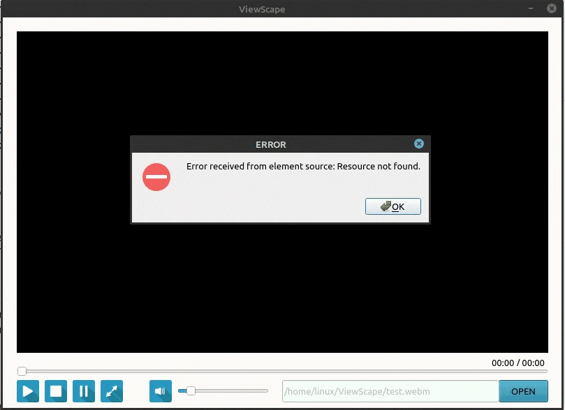

# ViewScape

## Содержание

[Описание](#description)   
[Полезные ссылки](#useful_links)

---

## Описание

ViewScape - это тестовый проект видеоплеера, разработанный на базе библиотеки QT C++ и GStreamer. Этот проект представляет собой простой плеер, с следующим функционалом:

- Воспроизведение
- Пауза
- Стоп
- Управление звуком с помощью ползунка
- Мгновенное отключение/включение звука с помощью кнопки
- Перемотка вдиео с помощью ползунка
- Отображение текушей временной позиции и общей продолжительности видео
- Выбор файла для воспроизвдения
- Вывод ошибок в формате диологовых окон

Функционал в разработке:
- Полноэкранный режим
- Скорость воспроизвдения вмдео

## Полезные ссылки

- [Документация QT  C++](https://doc.qt.io/)
- [Документация GStreamer](https://thiblahute.github.io/GStreamer-doc/doc_index.html?gi-language=c)
